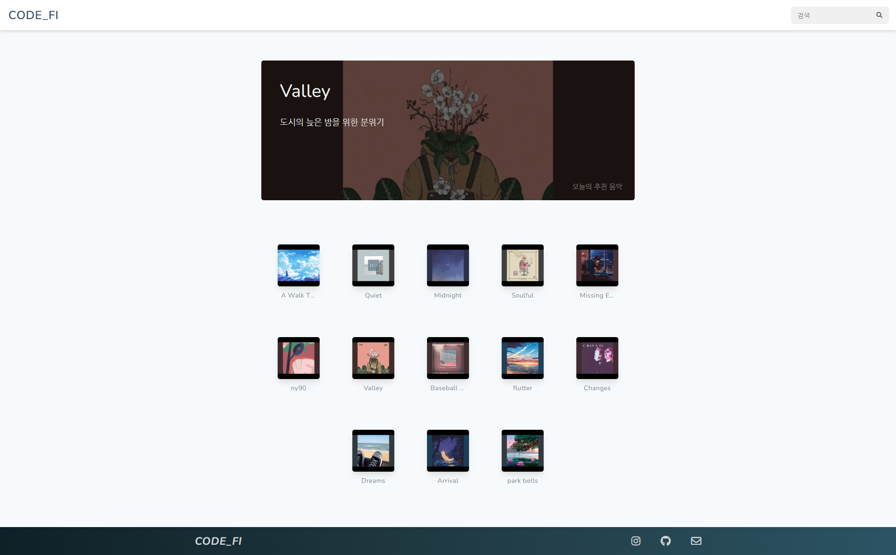
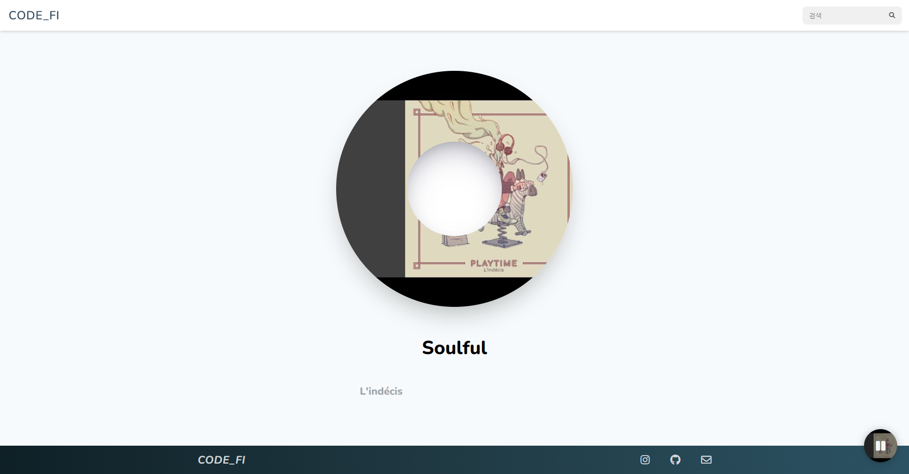

# Lofi streaming

**Home**



<br/>

**Music**



<br/>

## Description

Play lofi music from [youtube](https://youtube.com) on website.
<br/>Do you like lofi...?

<br/>

## Installation

```bash
# repository
$ git clone https://github.com/KHJcode/lofi-streaming.git
$ cd lofi-streaming

# dependencies
$ yarn install
```

<br/>

## Running the app

```bash
# format code
$ yarn lint

# development
$ yarn dev

# build
$ yarn build

# production
$ yarn start
```

<br/>

## Contributing

Contributions are welcome.

Just run before `yarn lint`.

<br/>

## Contact

[to@khjcode.com](mailto:to@khjcode.com)

If you have any question or need help, feel free to contact me.

<br/>

## License

MIT © [KHJcode](https://github.com/KHJcode)
